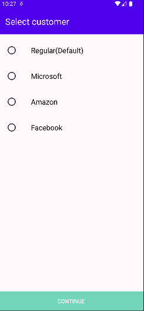
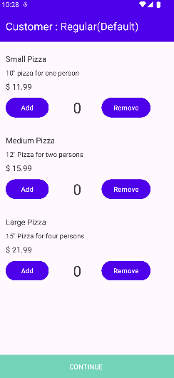
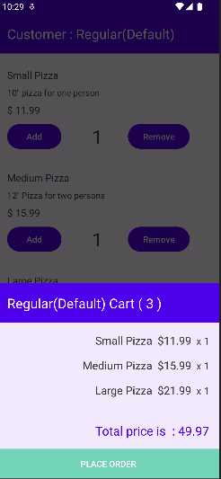

# Shopping Cart App

## Description

The Shopping Cart App is a simple Android application that allows users to manage their shopping cart by adding and removing items. The app utilizes offline storage to simulate the functionality of a typical shopping cart. It follows the principles of clean architecture, leveraging ViewModel and Hilt for dependency injection.

## Features

- Add items to the cart
- Remove items from the cart
- View the total price of the cart
- Offline storage for the product catalog and user's shopping cart
- Clean architecture design for better maintainability and scalability

## Technologies Used

- Android Studio
- Kotlin
- Jetpack Libraries (ViewModel, LiveData, Room)
- Hilt for dependency injection

## Screenshots

*Screenshot 1: Home screen displaying the list of available products*

*Screenshot 2: Cart screen displaying the items added to the cart*

*Screenshot 2: Cart screen displaying the items added to the cart*

## Installation

1. Clone the repository: `git clone https://github.com/your-username/shopping-cart-app.git`
2. Open the project in Android Studio.
3. Build the project and run it on an emulator or physical device.

## Testing

The application is thoroughly tested using both unit and integration tests. The test cases cover various functionalities including adding items, removing items, calculating prices, and applying discounts.

## Contributing

Contributions are always welcome! Please feel free to fork the repository and submit pull requests.

## License

This project is licensed under the MIT License - see the [LICENSE](LICENSE) file for details.

